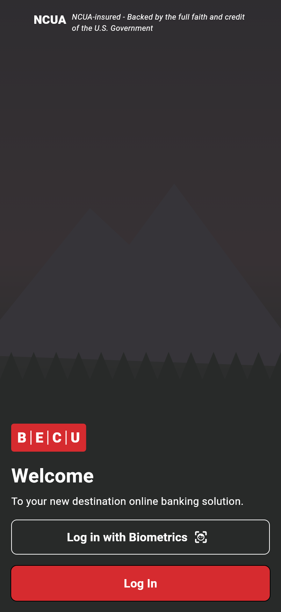
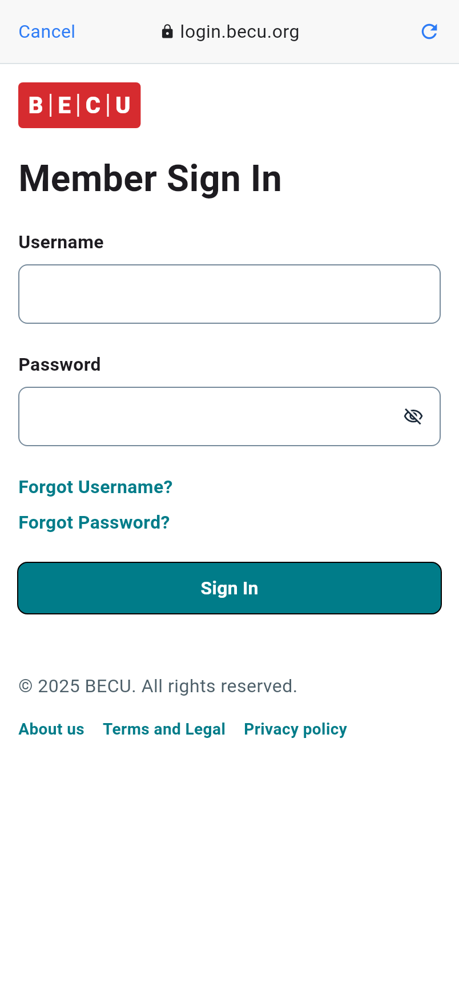
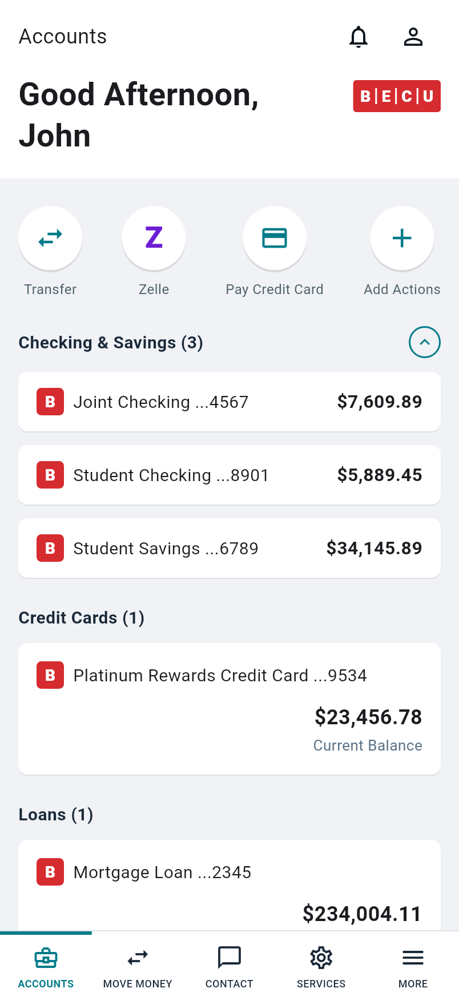
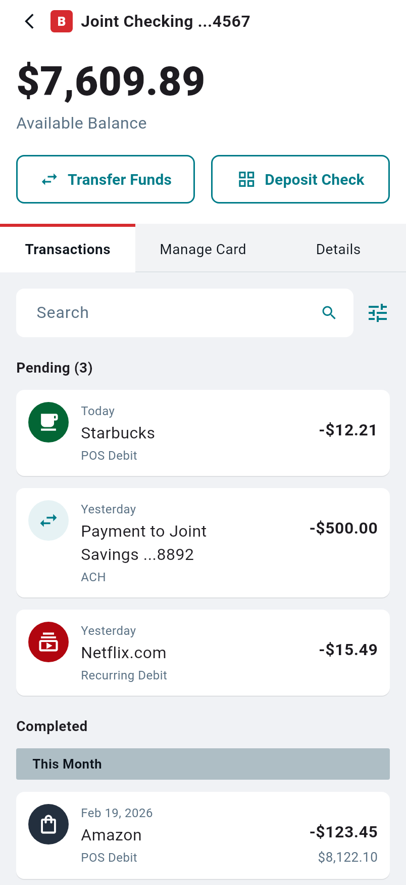
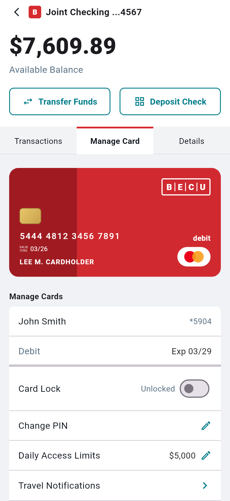
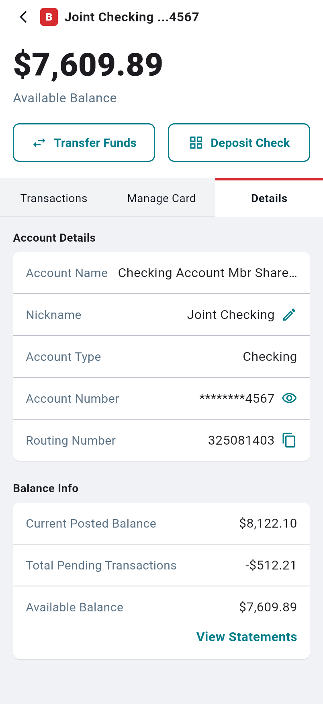
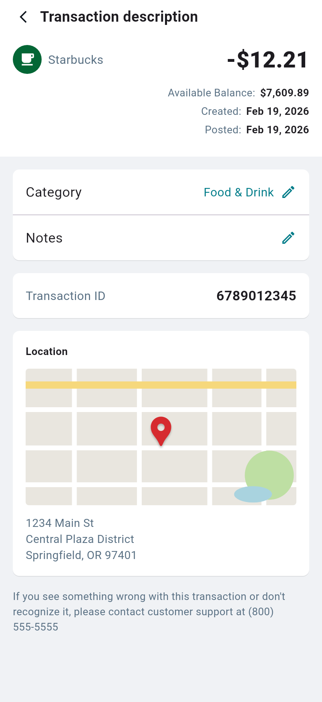

# BECU Mobile Banking Prototype

A Flutter prototype of the BECU mobile banking UI, built from the
[treXis | BECU](https://www.figma.com/design/03zrP7dWSJ9NPGNqWD34bf) and
[Accounts Statements](https://www.figma.com/design/Ot1rKUk37KmXmEmhExqWdu)
Figma designs. All data is mocked; no real services are called.

## Screens

| Welcome (screen door) | Member Sign In | Account Summary |
| --- | --- | --- |
|  |  |  |

| Transactions | Manage Card | Details | Transaction Details |
| --- | --- | --- | --- |
|  |  |  |  |

## Flow

Welcome → **Log In** → Member Sign In → **Sign In** → Account Summary →
tap an account → Account view (Transactions / Manage Card / Details tabs)
→ tap a transaction → Transaction Details.

"Log in with Biometrics" skips straight to the Account Summary. Working
interactions include the password visibility toggle, section collapse,
tab switching, the card lock switch, account number reveal, and copying
the routing number.

## Project layout

- `lib/theme/app_theme.dart` — design tokens (colors, Public Sans via google_fonts)
- `lib/data/` — mock accounts/transactions and currency formatting
- `lib/widgets/` — shared pieces (BECU wordmark/badge, surface card)
- `lib/screens/` — one file per screen; the three account tabs live in
  `lib/screens/account_tabs/`

Notes on fidelity: the Figma photo background, merchant logos, and the
map are recreated with gradients, icons, and `CustomPainter` placeholders
since the original assets aren't bundled.

## Running

```sh
flutter pub get
flutter run            # device/simulator, or: flutter run -d chrome
flutter test           # widget tests
```

To regenerate the screen renders in `docs/screenshots/`:

```sh
flutter test test/screenshots_test.dart --dart-define=screenshots=true --update-goldens
```
